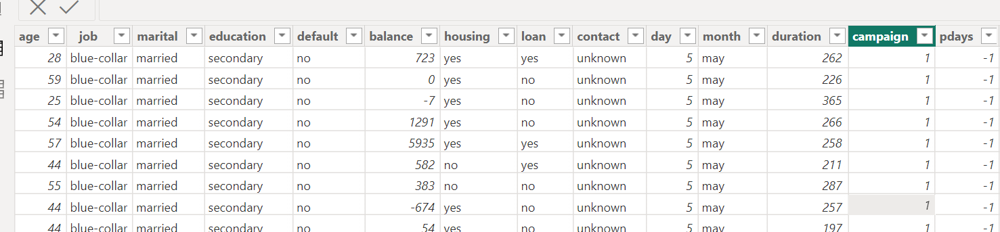

## Introdction to Power BI

### Introduction

This report serves as an introduction to Power BI. The assigned tasks include web data extraction within Power BI, importing a dataset into Power BI, and creating columns and rows with added information. These tasks are designed as an introductory experience with Power BI.

### Problem Statement

1. Extract information from a website and bring it into Power BI

2. Bring the Bank_term dataset into Power BI

3. Generate four columns and five rows of data within Power BI

### Result/Discussion:

The provided screenshot displays the top 10 richest countries, obtained through a web search within Power BI.

The screenshot provided shows the dataset imported from Mysql into Power BI.

The screenshot displayed above shows the columns and rows that have been created with information added within the power bi.
